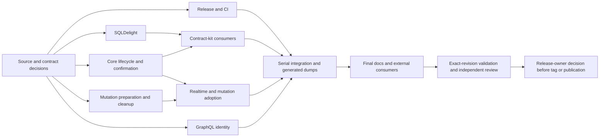

# Store6 initial alpha revision implementation plan

> **For agentic workers:** Use `superpowers:subagent-driven-development` or `superpowers:executing-plans` to implement this plan. Steps use checkboxes. An orchestrator owns source authority, integration, verification and the final release boundary.

**Goal:** Correct or explicitly disposition the findings in the [2026-09-05 adversarial review](../reviews/2026-09-05-store6-alpha-adversarial-review.md), then produce a release candidate whose claimed behavior and validation can be checked at one revision.

**Architecture:** Independent module changes run in isolated worktrees. One worker owns each source surface. Changes to core confirmation semantics precede integrations that consume them; generated ABI and Swift output is integrated serially. The alpha's accepted two-step durable acknowledgement posture remains intact.

**Tech stack:** Kotlin Multiplatform 2.3.20, kotlinx-coroutines 1.8.1, Gradle 8.11.1, Room 3, SQLDelight, AndroidX Paging, SKIE 0.10.13, GitHub Actions. Read the live catalog before executing; these are the audited pins, not permission to upgrade them.

**Status:** Plan prepared; implementation not started. The user requested a review and plan. This artifact authorizes no publication, merge, tag, issue closure, external message, or product/API waiver. It contains executable work packages and explicit decision boundaries rather than assumed approvals.

## Source lock and completion rules

- Reviewed branch: `store6`, SHA `b123c95a373f3629c23e797cb97e2bca18bb260a`. GitHub confirmed this was the live release branch during the review.
- The current user checkout `/Users/matt/src/matt-ramotar/Store6` is stale `main`. **Do not execute source changes there.** The read-only review snapshot `/private/tmp/store6-alpha-review-2026-09-05` has no Git worktree metadata and is evidence, not an implementation branch.
- On implementation kickoff, verify remote branch/HEAD and local changes. If the release branch moved, compare every finding's files and tests against the new committed base; mark fixed findings with evidence rather than reapplying patches. Record the new SHA before worker dispatch.
- Create an integration worktree and isolated worker branches from that exact base, using `matt-ramotar/alpha-<lane>` names. If a name already exists, inspect it and choose an unused name; never reset or overwrite another task's branch.
- The paths in each lane are **repository-relative paths on the release branch**. For example, `core/src/...` means the worker's release worktree, not the old Store5 `core` directory in stale main. Workers report absolute worktree paths in handoffs.
- Read release-branch `AGENTS.md` and `plugins/internal/documentation/skills/{documentation-discipline,code-documentation}/SKILL.md` plus their required references. Preserve behavior-bearing tokens in prose-only changes and byte-identical shared test comments.
- No agent writes another lane's files. If a necessary change crosses ownership, submit a patch proposal to that owner. A discovered shared dependency changes the task graph before either agent edits it.
- The orchestrator alone runs Gradle, or explicitly leases it to one worker at a time. No concurrent Gradle processes across these worktrees. A wrapper/sandbox failure before tasks start means zero tests executed. Stop that execution path; do not probe caches/locks/daemons or retry variants to bypass it.
- Preserve original failing XML/stdout before changes or later runs. No retries, weakened assertions, altered protected seeds, or scheduler barriers that conceal the behavior being tested. A new changed implementation may be verified after the first-red evidence is archived.
- Commit/push/PR/merge boundaries follow the implementation kickoff's explicit authority. Do not assume this planning request grants them. Local source edits and verification can be prepared for review without external publication.

## L0 — Orchestrator: freeze decisions and the testable contract

**Ownership:** local decision/acceptance ledger and worker manifest. No runtime files. Start before dispatch; independent noncontroversial lanes need not wait for all rows.

- [ ] Confirm source lock, worktree state, 41-project census, and pre-existing user files. Save source SHA and source hashes for protected tests.
- [ ] Start a ledger with every `F01`–`F15` and `C01`–`C07`, owner, current evidence, status, exact fix/refutation commit when applicable, and release disposition. Allowed final dispositions: fixed with evidence, disproven with evidence, explicitly accepted with user-visible limitation, deferred because capability does not ship, or still blocking. “Tests green” alone is not a disposition.
- [ ] Freeze the following narrowly scoped choices. Record explicit user rulings if already available; a previous agent recommendation is not a ruling. Prepare recommended designs and test fixtures while a decision is pending.

| Decision | Recommended starting position | Dependent work |
| --- | --- | --- |
| D1: shipping roster | Preserve the existing ten-library-plus-BOM allowlist. State explicit status/target for every other module; do not add it because its build passed. Any different roster must change allowlist, BOM and STABILITY together. | L1 release inventory, L8 final prose, optional L9 |
| D2: metadata authority (F04/C02) | Bind metadata to an exact applied writer and freshness evidence captured no later than the mutation push send. A competing write must keep its own metadata. Later invalidations must remain stale. Choose atomic apply+metadata or an explicit guarded token API after inspecting seam constraints. | L3 confirmation work, then L4 |
| D3: adoption and projection (C03) | Preserve the intent durably for recovery while excluding its optimistic transform only from observations that prove its source adoption committed. An ACKED phase alone is insufficient. | L3 attribution support if required, L4 projection fix |
| D4: Bookkeeper.status (C01) | Preserve Store's typed failure channels and conservative freshness. Choose typed retrieval failure/recovery or an explicitly infallible status contract across all implementations. Do not equate failed I/O with known-fresh metadata. | L3 status leg, L7 status kit, L9 file |
| D5: GraphQL numbers (F08) | Establish one finite-number identity rule. Equal values must share hash and canonical identity. Decide signed-zero normalization and whether Int/Float remain distinct. Reject nonfinite inputs unless the public contract deliberately supports them. | L6 |
| D6: target promise (F12) | Document the verified device/tested/compile-only matrix first. Add simulator variants only when intended and dependencies support them. | L1 optional target changes, L8 |
| D7: retained alpha limits | Keep accepted two-step acknowledgement and PARKED retirement pin. C02/C03 have no inferred waiver. A decision to defer an exposed correctness fix must name the observable consequence and affected callers. | L4, L8, release acceptance |

**Gate 0:** Each dispatched task has a concrete acceptance contract. L1's basic release gate, L2, L5 and L7's existing-contract tests can proceed independently; D2–D4 block only the affected core/integration legs. No source API materialization based on unresolved semantic choices.

## Dynamic dispatch and dependency graph

There are three worker slots plus the orchestrator. Fill a free slot with the highest-priority ready task. The following is one valid schedule, not a requirement to wait for an entire wave when dependencies are satisfied.

| Window | Worker 1 | Worker 2 | Worker 3 | Dependency rule |
| --- | --- | --- | --- | --- |
| First parallel work | L1 release/CI | L2 SQLDelight | L5 mutation preparation/retention | Disjoint files. L0 decisions run alongside. |
| As slots free | L3 core | L6 GraphQL | L7 contract kits | L3 semantic legs await D2–D4; L7 failure consumers require L2, and status checks require L3/D4, before green integration. |
| Integrations | L4 realtime/mutation adoption | L8 docs/consumer preparation | L10 unresolved-evidence triage | L4 requires L3 contract and L5 completion. L8 can draft earlier; final claims wait for code. |
| Conditional extra scope | L9 Paging | L9 Swift | L9 file/scheduler | Separate child tasks only when roster or follow-up scope justifies them. Each has its own files. |
| Final serial work | Integration, generated output, exact-head checks | Independent review | Independent claim/consumer review | Orchestrator integrates; no shared generated-file writers. |

Read-only adversarial workers can examine a candidate at any point. They do not edit the author's files. If a new failure appears, preserve it, define a bounded hypothesis task, and dispatch it when a slot is free. Do not create a second writer for a shared Kotlin file or silently enlarge the release floor.

**Dependent worktree refresh:** Before L4 implementation/testing, integrate the reviewed L3 and L5 patches and refresh L4's worktree to their combined source. Before final L7 checks, refresh its worktree with L2 and the L3/D4 status changes. Use an exact integration commit when commits are authorized; otherwise apply the reviewed prerequisite patches and record their hashes alongside the base SHA. Never test a dependent lane against its original base and report integrated success. Do not discard unrelated worker changes while refreshing.

## L1 — Release gate, execution provenance and target configuration

**Findings:** F01, F02, automation portion of F11, configuration portion of F12. D1/D6 apply when changing roster/targets.

**Exclusive files:** `.github/workflows/ci.yml`, `.github/workflows/store6.yml`, `.github/workflows/store6-full-jvm.yml`, other required workflow files; `bom/build.gradle.kts`; `gradle.properties`; `tooling/plugins/src/main/kotlin/org/mobilenativefoundation/store/tooling/plugins/Store6Conventions.kt`; `tooling/plugins/src/main/kotlin/org/mobilenativefoundation/store/tooling/plugins/Store6MultiplatformConventionPlugin.kt`; affected subset module `build.gradle.kts` files. Other lanes hand this worker configuration requests. L8 owns RELEASING/CHANGELOG/STABILITY.

- [ ] Write a release evidence manifest naming required checks for **shipping artifacts**, source SHA, artifact inventory, permitted classifications and intended version. The current whole Store6 matrix is the default; exclusions require an explicit roster/validation decision.
- [ ] Add a harmless workflow validation harness/stub covering valid tag, mismatched version, snapshot tag, forbidden repository, missing/failed/pending/cancelled matrix, wrong-SHA green, and allowed snapshot dispatch. Preserve current repository and version guards.
- [ ] Make publication depend on complete required validation for that same SHA, through reusable jobs or a fail-closed exact-SHA evidence check. An environment approval alone is not technical evidence; a newer green branch is not enough.
- [ ] Force fresh full-suite **test execution** in the scheduled lane. Prefer disabling cache/up-to-date reuse for that test task; if using a workflow flag, prove it forces the test and does not restore XML as execution. Preserve compilation caching if possible. Record task outcomes plus test identifiers and run provenance; do not rely only on file timestamps/counts.
- [ ] Archive and classify the first fresh full-suite result. Two successive unchanged-input runs must show executed `:mutations:jvmTest`, not FROM-CACHE/UP-TO-DATE. A first failure becomes evidence for L10; never rerun it merely to obtain green.
- [ ] Replace the hardcoded local-publication validation version with the root property. Verify every publication and BOM constraint resolves the same version. L8 removes the now-obsolete manual duplicate-version instructions.
- [ ] Add prepublication release-note validation and an idempotent postpublication GitHub Release/receipt step, using a stub during development. A failure after Maven succeeds must preserve the publication receipt and request record repair, not republish the immutable Maven version.
- [ ] Verify the full-suite failure-reporting destination exists and can be used in the eventual upstream release repository. The current duty text points to absent `docs/v6` conduct on the release branch. Provide a durable accessible record; no external issue or message is sent during implementation tests without explicit authorization.
- [ ] For D6 target additions only, verify upstream dependency module metadata, add supported simulator targets/subset exclusions, and update the consumer matrix. Do not invent unsupported Room/Paging variants. Leave API dump regeneration to integration.

**Acceptance:** All negative workflow fixtures block publication. Shipping allowlist=BOM=STABILITY release set. The scheduled log proves actual test execution. Publication simulation and record-repair simulation are inspectable. A real signed Central deployment is reserved for the release-owner gate, not claimed by a stub or Maven Local run.

## L2 — SQLDelight cancellation atomicity

**Finding:** F03. No new API policy is required to uphold the existing exception-atomicity contract.

**Exclusive files:** `sqldelight/src/commonMain/kotlin/org/mobilenativefoundation/store6/sqldelight/internal/DriverAccess.kt`, `sqldelight/src/commonMain/kotlin/org/mobilenativefoundation/store6/sqldelight/SqlDelightSourceOfTruth.kt`, `sqldelight/src/commonMain/kotlin/org/mobilenativefoundation/store6/sqldelight/SqlDelightBookkeeper.kt`, and `sqldelight/src/**` regression fixtures/tests. L8 coordinates README wording; L1 owns build files.

- [ ] Extend `SqlDelightAtomicityTest.kt` in its existing source set. Capture the caller Job, apply a row change inside the synchronous callback, cancel the captured Job without throwing, return, and record the call's normal/exceptional completion separately from enclosing coroutine cancellation.
- [ ] Add commit/afterCommit cancellation coverage for transactional writes; also test explicit callback-thrown cancellation and cancelled queued admission. Ask the Gradle lease owner to run `./gradlew :sqldelight:jvmTest --stacktrace`; archive the first red and the selected test count.
- [ ] Add a mutation-specific driver-access helper or equivalent single outer `withContext(NonCancellable + HeldDriverAccess(...))` after cancellable admission. Check that held-access ownership and nested job identity still recognize the transaction. Preserve read cancellation.
- [ ] Route all committing source mutations and Bookkeeper maintenance through the protected boundary. An inner NonCancellable block under the old outer frame is forbidden because it leaves the observed completion window.
- [ ] Verify write/delete/deleteNamespace/deleteAll, transaction rollback, nested reentry, cancellation-before-admission and reader notification. Explicitly test Bookkeeper `markStale`, namespace/global watermark advancement, `forgetNamespace` and `forgetAll` at the same cancellation boundary. A thrown operation must not have applied; a completed admitted mutation must have settled its notification.
- [ ] Hand L7 a generalizable fault injector and test schedule, not a claim that the contract kit already covers it.

**Acceptance command:** `./gradlew :sqldelight:jvmTest --stacktrace`. Run SQL-backed Native fixtures on declared targets, including `:sqldelight:iosSimulatorArm64Test` and `:sqldelight:macosArm64Test` in the configured Apple environment. Existing `commonSqlTest` is wired to JVM/Android/Native, so a JS task does not establish SQL atomicity without a new applicable driver fixture. No “fixed” status if the regression could not execute.

## L3 — Core request lifecycle and confirmation authority

**Findings:** F04 core support, F07, C01/C02 and any C03 core attribution support. **Single writer for all `core/src/**`.** D2–D4 govern their respective semantic legs. F07 can proceed while those decisions are pending.

**Exclusive source files:** `core/src/commonMain/kotlin/org/mobilenativefoundation/store6/core/internal/KeyEngine.kt`, `RealStore.kt`, `RealStoreRuntime.kt`, `StoreLifecycle.kt`, `Transitions.kt` in that same internal package; `core/src/commonMain/kotlin/org/mobilenativefoundation/store6/core/seam/StoreWriteHandle.kt`, `StoreRuntime.kt`, `Bookkeeper.kt`; affected core tests and KDoc. Generated `core/api/**` belongs to integration.

- [ ] Add deterministic close/get tests before changing lifecycle: pause a seeded LocalOnly request in status, close with the gate still closed, and require request cancellation/cleanup without a returned value. Repeat first hydration and lock admission. Preserve the caller's parent job.
- [ ] Fix lifecycle binding for the complete get operation, disposing its close hook at exit. Preserve single-flight ticket ownership and noncancellable commit tails. Keep existing `StoreCloseLifecycleTest` exact-message tests.
- [ ] Under D2, write engine regressions for an old fetch committing between apply and confirmation and for a second writer/binding. Verify the exact value/ETag pair, not just emitted value. Add invalidation between evidence capture and confirmation.
- [ ] Implement the smallest reviewed guarded-confirmation or combined-commit seam. Return/consume exact authority, not a value equality heuristic. Specify behavior on superseded writer, expired key engine, namespace/global invalidation, and restart. A token captured at acknowledgement staging is too late for C02.
- [ ] If D3 needs core support, expose only the necessary adoption/observation identity or publication fence. Do not remove durable mutation membership inside core or infer confirmation from an ACKED phase.
- [ ] Under D4, test initial and active status failures, cancellation, recovery and conservative stale state. Implement the agreed failure channel consistently. Avoid blanket catch/return-null that erases known stale authority.
- [ ] Run `./gradlew :core:jvmTest --stacktrace` under the lease. Retain existing fetch cancellation classification, newer-residence-on-failed-fetch, clear carve-out and projection authorization tests. Report every public API delta to integration.

**Handoff to L4:** exact signatures, legal sequencing, writer/freshness evidence lifetime, adoption observation semantics, tests and compatibility implications. L4 may prepare tests before handoff but cannot guess the API.

## L4 — Realtime and mutation acknowledgement integration

**Findings:** F04 callers, C02, C03. **Dependencies:** L3 confirmation contract and L5 mutation-file completion; D2/D3 decisions. One worker owns both integrations because they share the protocol and `MutationEngine.kt`.

**Exclusive files after L5 handoff:** `realtime/src/commonMain/kotlin/org/mobilenativefoundation/store6/realtime/RealtimeBinding.kt`; realtime tests; `mutations/src/commonMain/kotlin/org/mobilenativefoundation/store6/mutations/MutationEngine.kt`, related protocol/storage records if the reviewed design requires them, and mutation ack/projection/restart tests. L8 owns general release prose; source KDoc follows this owner.

- [ ] Reproduce F04 using a real engine: gate the Upsert write, let the old fetch queue at its write lock, finish apply, permit that fetch commit, then resume confirmation. Require coherent `v1/e1` or `v2/e2`, never `v1/e2`. Confirm with a subsequent conditional NotModified request.
- [ ] Integrate L3's exact authority into realtime and ack adoption. Do not use the binding mutex as a substitute for an engine fence.
- [ ] Add C02 key/namespace/global invalidation after push send but before ack. No active collector is needed. After adoption, those later marks must remain stale. The existing `MutationAckPathTest.ack_confirmFreshClearsDurableStaleness` case for **earlier** staleness must still pass.
- [ ] Specify and implement evidence lifetime for retries, aliases and reopened ACKED entries. If a restart cannot prove the prior freshness observation, use the reviewed conservative behavior, not newly invented fresh evidence.
- [ ] Reproduce C03 with a pure increment/append transform and an acknowledged echo. Hold confirmation/effects after adoption; assert no doubled projection. Include a queued suffix that must still remain optimistically visible.
- [ ] Fence projection membership on proven adoption commit, not merely `phase == ACKED` or a late flag written after apply returns. Preserve `ack_neverReemitsOldBase`, pending durable rows, alias handoff and retry behavior. Execute a restart matrix covering ACKED before source adoption, ACKED after source adoption, and EFFECTS_PENDING; each must retain necessary recovery data without applying the acknowledged optimistic prefix twice.
- [ ] Run `./gradlew :realtime:jvmTest :mutations:jvmTest --stacktrace`, archive counts/results, and hand all API/storage changes to integration. A storage-format change requires an explicit migration/recovery test and compatible old-record interpretation.

**Acceptance:** Both realtime and mutation paths preserve content/metadata identity, later invalidations and exactly-once optimistic application relative to the adopted prefix. The journal/source-of-truth crash boundary is still the documented alpha two-step posture.

## L5 — Mutation preparation containment and completed-history retention

**Findings:** F05, F06. Runs before L4 touches the same engine file.

**Exclusive files until handoff:** `mutations/src/commonMain/kotlin/org/mobilenativefoundation/store6/mutations/MutationEngine.kt`; mutation preparation, parking, pruning, retirement and test-helper files under `mutations/src/**`. Runtime ownership transfers to L4 only after this lane's patch and tests are recorded.

- [ ] Add a new live-encode parking regression beside `MutationDrainParkingTest`: argument codec succeeds, projected value encoder fails, valid same-key suffix and different-namespace work are queued. Repeat with the precondition-selector copy path. Archive the first red using `./gradlew :mutations:jvmTest --stacktrace`.
- [ ] Contain only codec failures at actual encode/copy boundaries and durably park with CODEC evidence. Assert UNPREPARED→PARKED without incrementing completed attempts; codec cancellation leaves the entry UNPREPARED and propagates without parking. Unrelated storage failures must not be mislabeled CODEC. Global drain must progress eligible work after the terminal bad intent.
- [ ] Add a test-only ownership snapshot for completed caches. Repeatedly write large distinct values to one key, acknowledge, confirm checkpoints and prune. Assert completed entry/blob references disappear; measure structure, not garbage collection timing.
- [ ] Add one completed-entry cleanup helper at a proven safe retirement/prune boundary. Preserve event payload construction, alias/effect continuations, parked evidence, active ACKED rows and unconfirmed retirement accounting. Do not remove `ackEffectiveTargetsByIdempotencyKey` just because its name resembles a retained map.
- [ ] Cover ordinary, alias and ServerWins completion, restart, a held active owner, and event payload integrity. Gate concurrent retirement and owner enumeration around cleanup to prove an active owner is never prematurely removed. Run the mutation JVM lane; report test counts and results.
- [ ] Hand L4 the exact completed patch, cache lifecycle invariants and new regression names. Release engine ownership; do not continue editing it while L4 integrates.

## L6 — GraphQL canonical numeric identity

**Finding:** F08. **Dependency:** D5. Runs independently of core and storage work.

**Exclusive files:** `graphql/src/commonMain/kotlin/org/mobilenativefoundation/store6/graphql/GraphQlValue.kt`, `Canonicalization.kt`, `GraphQlOperationKey.kt`, related variables implementation, canonicalization tests and source KDoc under `graphql/src/**`.

- [ ] Add equal/hash/canonical-identity regressions for `0.0`, `-0.0`, NaN, infinities, and Int/Float whole-number values. Test through GraphQlVariables and GraphQlOperationKey, including hash-set behavior.
- [ ] Archive first-red JVM and JS results using `./gradlew :graphql:jvmTest :graphql:jsNodeTest --stacktrace`. A zero-selected test result is not evidence.
- [ ] Implement D5 consistently across equality, hash and canonical rendering; validate inputs at construction where appropriate. Preserve ordering/escaping behavior and assess canonical-key compatibility for persisted callers.
- [ ] Rerun both lanes and verify valid number/string/boolean/null/list/object distinctions. Give L8 a precise migration note if canonical identities change.

## L7 — Contract kits and consumer substitution

**Finding:** F09, verification portion of F03 and C01. **Exclusive files:** `testing/src/commonMain/kotlin/org/mobilenativefoundation/store6/testing/SourceOfTruthContractKit.kt`, `BookkeeperContractKit.kt`, related testing fixtures/tests under `testing/src/**`. Consumer source files remain owned by their module lanes; request wrappers from those owners.

- [ ] Inventory each current kit method and map it to the public seam clause it checks. Record absent clauses before adding tests.
- [ ] Generalize L2's commit-boundary failure injector into an optional/testable kit extension. Add external cancellation and throw-means-not-applied assertions. A transactional extension must prove rollback and no reader notification on failure.
- [ ] Add Bookkeeper cases for global watermark coverage of never-seen keys, later success clearing only covered marks, one monotone sequence across marks/success, and forget/forgetNamespace/forgetAll removing records while retaining the required watermarks.
- [ ] Add D4's status contract checks once chosen. Preserve cancellation transparency and existing adapter-specific conservative behavior.
- [ ] Coordinate explicit kit invocation by every applicable shipped consumer. A new public kit method with no consumer call is not coverage. Add file as a diagnostic consumer without adding it to the release allowlist.
- [ ] Run `./gradlew :testing:jvmTest :sqldelight:jvmTest :room:jvmTest :mutations:jvmTest --stacktrace` after L2 integration, with actual consumer/test census. If testing file, request `:file:jvmTest` separately. Preserve any new failure for its owner; never weaken the shared kit merely to pass all adapters.
- [ ] Report public API additions; integration regenerates `testing/api/**` and affected consumers' generated output.

## L8 — Release documentation and external-consumer proof

**Findings:** F10, prose portion of F11/F12, C04; final limitations from other lanes. Drafts can run early. Final prose waits for runtime decisions and verification.

**Exclusive files:** `README.md`, `STABILITY.md`, `ROADMAP.md`, `RELEASING.md`, `CHANGELOG.md`, `llms.txt`, `docs/store6/**`, module README files and `plugins/store/**` if a changed API actually requires synchronization. Do not edit source KDoc owned by implementation lanes; submit exact wording requests. No external docs-site edits without a separately scoped handoff.

- [ ] Build a roster from D1: coordinate, version, tier, targets, shipping/deferred status and publication mechanism. Compare it mechanically with L1's allowlist/BOM. Describe Swift separately from Maven; local XCFramework instructions are already explicit.
- [ ] Correct quickstart's unqualified memory claim and Room's stale cancellation paragraph against verified behavior. Add configured consumer prerequisites and distinguish compile SDK/build tools from runtime minSdk. Compile a fresh consumer before claiming the documented setup works.
- [ ] Explain PARKED high-water consequences and available recovery without inventing discard/requeue APIs. Include only explicit waivers from D7, with affected operations, observable behavior and workaround.
- [ ] Update RELEASING for the actual same-SHA gate, fresh-test evidence, one version source, release record/receipt and partial-release recovery. Do not describe simulated publication as proven Central deployment.
- [ ] Prepare alpha notes with correct core tier, actual shipping roster, accepted limitations, a verified community issue/guarantee link, release date and next-alpha target selected by the release owner. Do not close or message an issue during drafting.
- [ ] Treat README/llms/quickstart “nothing published” as a publication-state transition. Prepare the exact edit, but do not claim availability until artifacts resolve. Preserve all existing site routes and source-transform boundaries unless the docs handoff explicitly changes them.
- [ ] Build external consumers outside the repository using publication artifacts, not project dependencies: JVM baseline and a coexistence fixture with Store5; Android minimum supported setup; KMP/Native and Swift only where promised. For local tests use an isolated Maven repository and record resolved coordinates/POM/module metadata, not just declared dependencies.
- [ ] Give the separate docs-site owner a source SHA, changed-source list, transform/snippet consequences and generated-reference requirements. A docs-sync-ack label acknowledges work; it is not proof the site has synchronized.
- [ ] Run separate accuracy, warrant and reader-utility passes. Verify source links, exact snippets, relative paths, coordinates and every remaining behavior/availability claim. Hand uncertain claims back to owners rather than polishing them into certainty.

## L9 — Optional deferred-module tasks

These are separate bounded tasks, not one shared writer. They do not block the unchanged alpha roster. If a capability is added to alpha, its task becomes a release prerequisite with the same proof requirements.

| Task | Exclusive files | Work and falsifiable acceptance |
| --- | --- | --- |
| L9-P Paging F13 | `paging-androidx/src/**`, especially `StorePagingBuilder.kt` and source/presenter tests | Choose safe default initial restart or required refresh mapping; anchor first-page content, invalidate, refresh and prove reachability. Cover explicit bidirectional mapping. Show factory invalidation on screen disposal with a long-lived Store. Run `./gradlew :paging-androidx:jvmTest --stacktrace`. |
| L9-S Swift F14 | `store6-swift/src/**`, `store6-swift/swift/Sources/**`, `store6-swift/swift/Tests/**`; generated facade dumps via integration | Add checked Kotlin wrappers for six maintenance operations, map errors in Swift, specify closed-store get/states/maintenance behavior. Use subprocess first-red crash tests. Refresh to the reviewed core dependency revision and acquire the Gradle lease. Run sequentially `./gradlew :store6-swift:macosArm64Test --stacktrace`, `./gradlew :store6-swift:assembleStore6KotlinDebugXCFramework --stacktrace`, then `swift test`. Require catchable persistence failures and process survival; preserve caller cancellation. |
| L9-F File F15/C01 | `file/src/**`, especially `internal/Base32.kt`, `FileNames.kt`, `FileBookkeeper.kt`, Unicode/cold-recovery tests | Reject malformed surrogate sequences before disk/mirror changes; prove distinct valid keys round-trip and cannot alias. Enforce D4 at cold recovery. Run `./gradlew :file:jvmTest --stacktrace` and eligible platform lanes; do not claim Python encoding proves Kotlin behavior. |
| L9-M Scheduler C06 | `mutations-drain/src/**`, `mutations-drain-meeseeks/src/**` | Gate two empty recovery scans before competing schedules; require one pending task, then zero after cancellation, not merely one tracked map entry. Prove manager uniqueness/serialization and safety-activation recovery. Run unit tests and separately record the property-gated real integration suites. Existing excluded failures remain explicit. |
| L9-O Telemetry release prep | `opentelemetry/src/**`, relevant tests | When shipping, derive or verify instrumentation version against publication version, preserve callback containment and documented cardinality behavior. No speculative telemetry refactor is required by this audit. |

## L10 — Evidence triage for unresolved prior candidates

**Findings:** C05, C07 and any new failure. Initial mode is read-only. Own only the local evidence ledger until a specific runtime defect and scope are established.

- [ ] Locate original first-red evidence for the prior committed-stream race and other carried candidates. Record source revision, exact assertion, task/test count, environment and reproduction status. A missing old artifact remains missing; do not relabel a later green as its diagnosis.
- [ ] For each candidate, attempt to falsify the mechanism against the integrated source before requesting code changes. Distinguish invalid seam implementations, defensive diagnostics and supported-use failures.
- [ ] Specify one deterministic schedule per surviving candidate: normally completing reader handling, rawCommitResolution locking, settlement-tail masking, projection backpressure, Room-internal cancellation, or Ktor timeout conversion. Do not dispatch a generic “fix concurrency” task.
- [ ] Request the one Gradle lease for a bounded probe. If blocked, continue source analysis and mark runtime evidence unavailable. Preserve first red. Disposition each candidate as reproduced, disproven, accepted limit or unresolved; none becomes “fixed” merely because unrelated tests pass.
- [ ] If a candidate affects the release floor, add a narrowly owned revision task and re-evaluate dependencies before editing. If it is deferred, record the affected release boundary. Escalate only a concrete unresolved contract decision, not routine implementation choices.

## Serial integration and release acceptance

The orchestrator integrates reviewed patches in dependency order. Preferred order: L2, L5, L3, L4, L6, L7, L1 configuration/targets, then final L8. L1's isolated development runs earlier; final configuration integration follows all reported API/target needs. Preserve unrelated changes and do not cherry-pick partial ownership transfers.

- [ ] Review each worker handoff: exact base, changed files, regression schedule, first-red evidence, final executed commands/counts, API delta, unresolved risks. Reject handoffs that only say “all tests passed.”
- [ ] Integrate one patch at a time. Resolve conflicts against current contracts; never overwrite another worker's file to obtain a clean apply. Reassign cross-file corrections to the owning lane.
- [ ] Regenerate JVM/Android/KLIB ABI dumps from integrated source using declared module `apiDump` tasks. Generate core/mutations/facade Swift output from its source tasks, compare repeated generation for determinism, then run `checkSwiftDumps`. Never hand-edit generated dumps. Regenerate after target changes, not from each worker's incompatible base.
- [ ] Execute the required integrated matrix: default JVM suites with their documented exclusions; fresh full mutations JVM/Lincheck lane; JS/Wasm lanes for declared modules; Apple iOS simulator/macOS tests; API/Swift checks; publication/consumer resolution; native stress; quickstarts and shipped adapters' contract-kit consumers. Derive exact tasks from integrated workflows and target declarations. Do not assume every module declares every target.
- [ ] Archive a matrix with revision, command, environment, expected/selected/executed tests, task cache outcome, failures/skips and evidence path. KLIB artifact checks, compile-only targets, cached correctness results and fresh stress execution remain separate evidence classes.
- [ ] If release validation needs hosted execution, record original workflow results at the final committed candidate SHA under the authority granted at kickoff. Recheck after any source/config/version change. PR-head green is not exact merge/tag proof. Do not trigger publishing as a validation shortcut.
- [ ] Independent reviewers challenge: (a) SQL exception atomicity and metadata authority schedules, (b) mutation recovery/cache/projection invariants, (c) release gating, consumer claims and docs. Reviewers may reject unsupported findings or ineffective tests as well as fixes.
- [ ] Close the ledger: all four current-alpha P1 findings fixed and verified, an explicitly approved concrete first-release control applied to an automation gap, or an affected optional artifact removed from the shipping roster with a public disposition. Every P2/open candidate has an evidence-backed disposition. F14 remains P1 before Swift distribution despite its exclusion from this alpha floor. No silently waived C02/C03; no deferred module silently added to alpha.
- [ ] Verify docs-site synchronization against the candidate if the release claims it as ready. A local source sweep or label does not prove the deployed experience.
- [ ] Present the reviewable release package: exact candidate SHA, findings ledger, matrix, artifact/BOM/POM inventory, consumer evidence, notes, known limitations, rollback/partial-release instructions and remaining owner decisions. **Stop before tag, merge, Maven release, GitHub release publication or announcement unless that exact action is explicitly authorized.**

## Finding-to-task completeness

| Review IDs | Accountable task |
| --- | --- |
| F01, F02 | L1 |
| F03 | L2; L7 reusable verification |
| F04 | L0 D2; L3; L4 |
| F05, F06 | L5 |
| F07 | L3 |
| F08 | L0 D5; L6 |
| F09 | L7 |
| F10 | L0 D1/D7; L8; L1 for roster configuration |
| F11 | L1 automation; L8 notes/runbook |
| F12 | L0 D6; L1 configuration; L8 disclosure |
| F13, F14, F15 | L9-P, L9-S, L9-F respectively; conditional on distribution |
| C01 | L0 D4; L3/L7; L9-F |
| C02, C03 | L0 D2/D3; L3/L4 |
| C04 | L8 under preserved accepted runtime rule |
| C05, C07 | L10 evidence triage |
| C06 | L9-M before scheduler distribution |

This plan is complete as a revision work breakdown. Release readiness remains an outcome to prove by executing it, not a claim made by writing it.

## Rulings — 2026-09-11 (Matt, interactive, one question at a time)

Recorded after a live status review. These are rulings, not recommendations. The L0 ledger rows
that depended on D1–D7 are closed by this section. Source lock at ruling time: fork release branch
`store6` @ `b123c95a` (unchanged since 2026-08-29); revision work already exists on
`matt-ramotar/alpha-candidate-2026-09-06` @ `3d62af80` (3 commits, 109 files), which implements
most of L1–L8 and supersedes this plan's "implementation not started" status line.

| # | Question | Ruling |
| --- | --- | --- |
| R1 | Release name | **6.0.0-alpha01.** No rename. ("preview01" appears nowhere and is not adopted.) |
| R2 / D1 | Shipping roster | **Everything green: 15 libraries + BOM** — the ten (core, testing, sqldelight, room, compose, graphql, realtime, mutations, mutations-testing, mutations-sqldelight) plus paging-androidx, opentelemetry, ktor, file, mutations-conflicts, plus bom. Consequences: F13 (L9-P), F15 + C01-at-cold-recovery (L9-F), and the otel scope-version constant (L9-O) become release prerequisites; ktor and mutations-conflicts get a bounded adversarial review before shipping; `store6-swift` stays unpublished (F14); devtools, devtools-inspector, mutations-drain, mutations-drain-meeseeks stay alpha02 as STABILITY names. This overrides the candidate branch's "Deferred; not in alpha01" rows written 2026-09-06 (those followed this plan's default, which was a recommendation). Manifest, BOM, allowlist, STABILITY, CHANGELOG and platforms.md change together. |
| R3 / F01–F02 | Publish gate | Publication waits at the exact tag SHA for build-and-test + the full Store6 matrix + **one forced-execution full mutations suite, sharded** + workflow fixtures. The two-execution pair is retired in favor of per-shard execution provenance. Sharding = deterministic custom-scenario split of the 100 Lincheck scenarios (Lincheck 2.39 seeds its generator with a constant 0, so splitting `iterations` would replay the same scenarios). Keep `forkEvery = 1`; revert `lincheck.instrumentAllClasses=true`; runner may move to macos-latest if measurably faster. The candidate's Lincheck "execution has hung" result (local integration run 2026-09-06, 395.6 min, storage bytes unchanged from store6 head) is classified first and never rerun to green. |
| R4 / D2–D7 | Semantic decisions | **Ratified as implemented on the candidate:** D2 `StoreWriteHandle.captureFreshness` + `applyAcknowledgement(key, value, etag, freshnessEvidence, adoption)`; D3 `Overlay.apply(key, base, adoption)` + `SourceAdoption`, exclusion only on proven adoption; D4 `Bookkeeper.status` may throw → typed Persistence channel, conservative freshness; D5 GraphQL finite-only, −0.0 normalized, Int/Float distinct, migration note; D6 platform matrix document, no new simulator lanes; D7 two-step ack + PARKED pin accepted and documented, no discard API. Verification still owes first-red evidence per lane; ratifying the design is not a claim the code is done. |
| R5 | Upstream landing | Fork `store6` → PR into the **protected upstream `store6` branch**; alpha tags are cut there; upstream main keeps the 5.1 line and gets a README pointer; merging into main is revisited at beta01/GA. |
| R6 | Docs cutover | Tag is independent of STORE-30. The announcement waits **at most one week** after the tag for the DNS cut; otherwise announce with the Vercel URL. The site's sync lock (currently `5a8c956b`, stale main) is re-pinned to the release SHA first. |
| R7 / R10-old | Closures in the notes | Close **#402** via `FreshnessPolicyConformanceTest.mustBeFreshRefetchesFreshResident` and **#536** via `SourceOfTruthConformanceTest.localOnly_prePopulatedSot_getServesWithoutFetcher`; fire the parked paging closures **#702/#602**; cite #534 (ROADMAP.md) and #570 (STABILITY §7 committed dumps) as answered by documents/mechanism; cite #722/#578 as answered by the mutations floor. Posting/closing is Matt's action at release. |
| R8 | POM identity | `POM_DEVELOPER_ID=mobilenativefoundation`, `POM_DEVELOPER_NAME=Mobile Native Foundation`. |
| R9 | Fork `main` | Rename to `archive/main-2026-08`; `store6` remains the only line; local checkouts switch once. |
| R10 | Kickoff authorization | Commit and push fork branches, dispatch hosted runs, open the PR from the candidate lineage into fork `store6` with the evidence package, archive `main`, commit the untracked Aug/Sep review + plan documents. Merges, the upstream PR, the tag, and any announcement remain Matt's. |

Stated defaults (not rulings): the notes name the next alpha's target month as one month after the
cut date; the initial shard count is 4.
